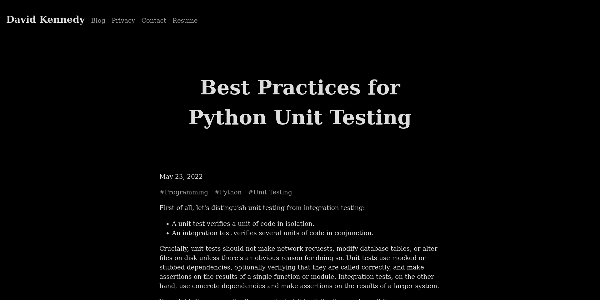
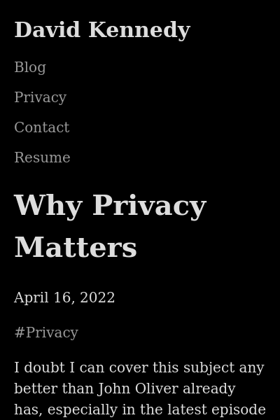

# Noir Theme for Pico CMS

> Depending on your server, you might need to run the following commands with elevated permissions.

> In each of the following commands, replace PICO_DIR with your Pico installation directory, e.g.
> `/var/www/localhost/htdocs/pico`.

> Skip ahead for instructions pertaining to the Nextcloud integration.

## Install

1. Run this command from this directory:

       $ cp -r themes/noir PICO_DIR/themes

2. Change the theme in your `config.yml` to `noir`.

## Update

1. Run the following commands from this directory:

       $ rm -r PICO_DIR/themes/noir
       $ cp -r themes/noir PICO_DIR/themes

## Uninstall

1. Run this command from this directory:

       $ rm -r PICO_DIR/themes/noir

2. Change the theme in your `config.yml`.

## Blog support

If you want to add a list of blog posts to your page, use the `blog-index` template. For blog posts,
use the `blog-post` template. Check out the included sample content for an example.

## Configuration

Various aspects of the theme can be configured via a file named `_theme.md` in your content
directory. See [here](content/_theme.md) for a complete example.

## Nextcloud

These instructions pertain only to the Nextcloud integration.

> In each of the following commands, replace PICO_DIR with your Pico installation directory, e.g.
> `/var/nextcloud/data/appdata_asdf1234/cms_pico`.

### Install

1. Run this command from this directory:

       $ cp -r themes/noir PICO_DIR/themes

2. In Nextcloud settings, go to Administration > Pico CMS and scroll down to the section labeled
   "Custom themes". Select "noir" from the dropdown menu and press the plus sign.

3. Still in Nextcloud settings, go to Personal > Pico CMS and select "noir" from the dropdown menu
   next to the name of your site.

### Update

1. Run this command from this directory:

       $ rm -r PICO_DIR/themes/noir
       $ cp -r themes/noir PICO_DIR/themes

2. In Nextcloud settings, go to Administration > Pico CMS and scroll down to the section labeled
   "Custom themes". Press the "Reload custom theme" button next to "noir".

### Uninstall

1. Run this command from this directory:

       $ rm -r PICO_DIR/themes/noir

2. In Nextcloud settings, go to Administration > Pico CMS and scroll down to the section labeled
   "Custom themes". Press the "Delete custom theme" button next to "noir".

3. Still in Nextcloud settings, go to Personal > Pico CMS and select another theme from the dropdown
   menu next to the name of your site.

